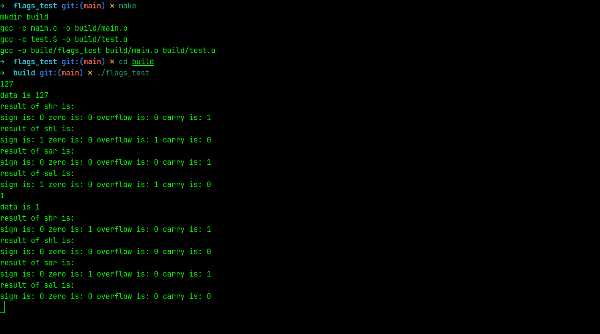

# x86环境下的移位操作后常用标志寄存器状态的变化

## 使用说明

本工具支持多种构建工具，包括`CMake`和`Make`

注意：windows平台需要`gcc`或者`clang`编译器,linux只需要安装`build-essential`包以及`cmake`工具

## 示例



### CMake

```shell
mkdir build
cd build
cmae ..
cmake --build .
```

### Make

```shell
make
```

### 主要实现

采用汇编指令来将输入的char类型先进行移位，然后对移位结果进行获取，并且打印出来。

该代码通过直观的形式来展示了各种移位指令对标志寄存器位的影响。
